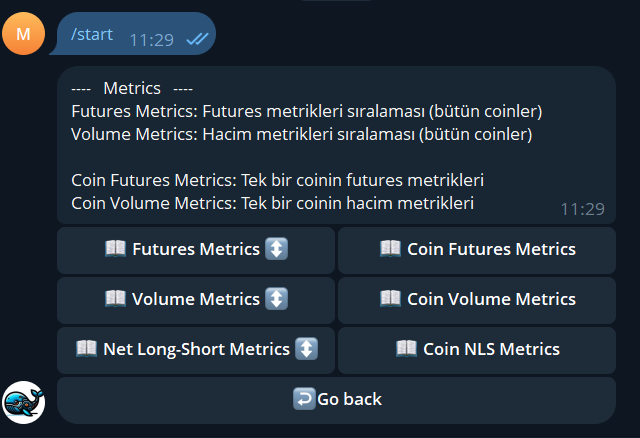

Tetabot – Crypto Market Data Visualization Telegram Bot
Tetabot was developed as a demo platform to showcase our data processing and prediction capabilities before launching our main product. Our main product was a prototype service called WhaleWatcher, a web and windows based crypto analytics service.

Project Background
WhaleWatcher was designed to provide users with advanced market data insights by aggregating, analyzing, and visualizing various cryptocurrency exchange data. It was going to feature interactive charts, tables, and an API service, along with user subscriptions and maybe a trial period.
The primary challenge was not the website itself, but building reliable data pipelines to collect, process, and gain meaningful insights from chaotic large scale financial data.

Why Tetabot?
Before the WhaleWatcher website was ready, we needed a way to publicly demonstrate the value of our data and analytics without requiring users to sign up for a new service or download an application. Since Telegram is widely used in the crypto community, we created Tetabot as a Telegram bot that allows users to quickly and easily view our charts and tables right within Telegram. Even though it looks unprofessional, it made it possible for us to show our potential users that we were not scammers like most people on the crpyto market. And we actually showed the data we can provide to them while explaning why they are useful for market prediction. We even used the same data in our somewhat successful algorithmic trading projects.

What Tetabot Offered
•	Instant access to key cryptocurrency market visualizations and tables.
•	Simple, user friendly commands designed for quick insights.
•	A completely free demo platform accessible anywhere Telegram is available.
While Telegram’s limitations impacted some UX aspects, Tetabot served as an effective ‘proof-of-concept’ tool, providing users with valuable data. It was open for access from 2024 to July 2025.

Technical Highlights
•	Built the backend data pipeline that powers the analytics and charts.
•	Integrated real time market data from various APIs and WebSocket streams.
•	Explored and even integrated third party payment systems for monetization but decided to not to do that for this demo phase.

Screenshots

